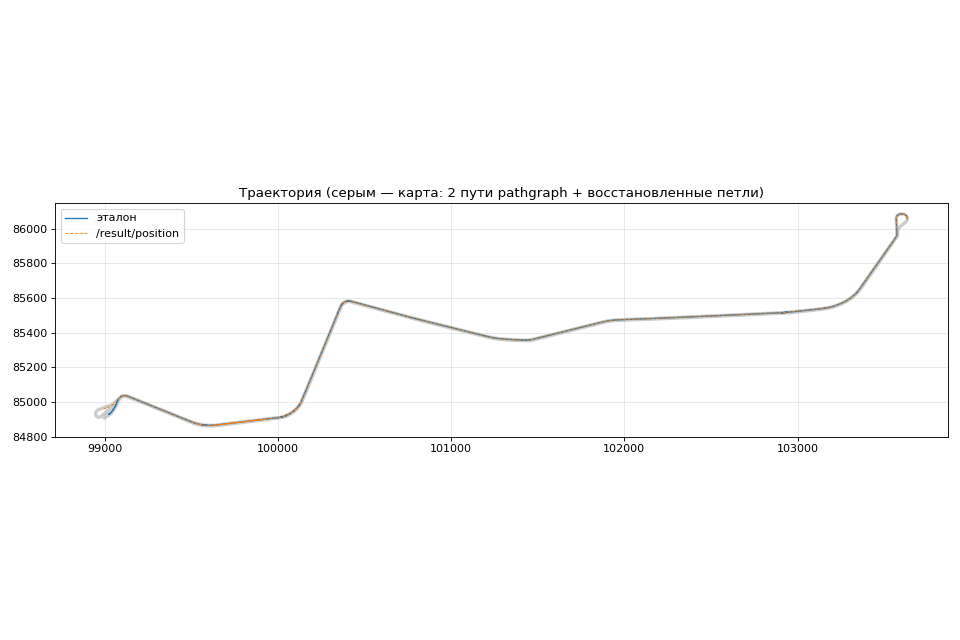
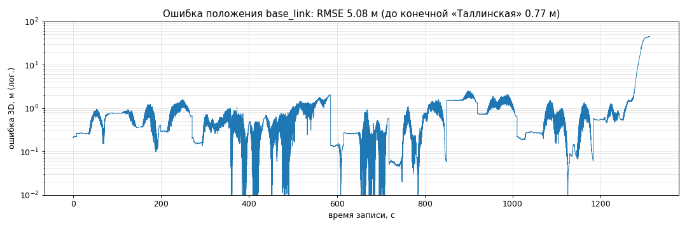
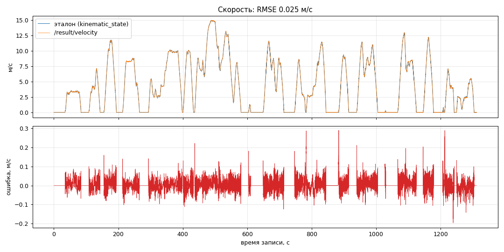
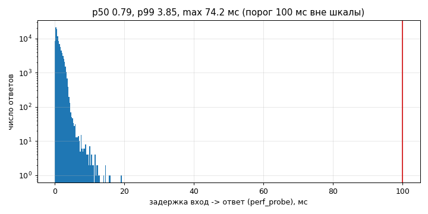

# Точность и быстродействие

## Как проверяли

Проверочная запись `30618_88aea4d9`: 21,8 минуты, около 5 км, от кольца «Щукинской» до конечной
«Таллинская». Эталон — топик `/localization/kinematic_state`. Судья организаторов
(`hackathon_solution_checker`) сопоставляет ответы с эталоном по `header.stamp` с допуском 0,05 с
и считает RMSE скорости и положения, по осям и в 3D.

Офлайн та же логика ноды (`core.py` и оценщик) прогоняется без ROS скриптом
`tram_backup_odometry/tools/offline_eval.py`. Сообщения подаются в порядке прихода, пары с
эталоном подбираются так же, как у судьи. С прогоном в ROS результаты совпадают до третьего
знака, поэтому большинство экспериментов шло офлайн.

На обучающих записях эталона судьи нет. Эталоном служит RTK GNSS самой записи: base_link
считается по антеннам master и rover, берутся только фиксы со status 2. Такой эталон местами
сам ошибается на метры (есть сбои GNSS и смещённые высоты), но решение от него не зависит, а
для сравнения версий между собой его достаточно. Для каждой записи считается RMSE положения, по
набору — среднее, медиана и 90-й процентиль.

Устойчивость проверяли искусственными сбоями:

- `--slip N` в `offline_eval.py`: примерно раз в 45 секунд при тяге или торможении показания
  искажаются на 10–40 % на 2–5 секунд, у обеих тележек или у одной; N — вариант случайной
  последовательности;
- `--gaps a,b`: колёсные данные пропадают на b секунд каждые a секунд, контроллер продолжает
  приходить;
- `fault_player --profile hard` в ROS вместо `ros2 bag play`: 1 % сообщений с NaN, inf или
  мусором, 1 % повторов, 1 % перестановок, нулевые и сбойные stamp, выбросы скорости, раз в
  минуту пропуск всех входов на 0,5–3 с, залипание задней тележки на ноль.

Быстродействие мерили с двух сторон. Внутри ноды — время от входа в колбэк до публикации обоих
ответов. Снаружи — `perf_probe`: время приёма ответа минус время приёма входа с тем же stamp;
сюда входят доставка DDS и очереди обоих процессов. CPU и память — по `/proc` процесса ноды раз
в секунду.

## Проверочная запись

| Прогон | Скорость RMSE | Положение RMSE: x / y / z / 3D |
|---|---|---|
| ROS с судьёй, Docker на Apple M4, воспроизведение ×4 | 0,027 м/с | 3,34 / 3,84 / 0,18 / 5,09 м |
| Офлайн, та же логика | 0,025 м/с | 3,33 / 3,83 / 0,18 / 5,08 м |
| Ранняя сборка: ROS, Ubuntu 22.04, 2 ядра, реальное время | 0,025 м/с | 3,88 / 4,38 / 0,18 / 5,86 м |
| Ранняя сборка: ROS, Docker на Apple M4, ×4 | 0,027 м/с | 3,88 / 4,39 / 0,18 / 5,86 м |

Ранняя сборка — версия до блоков проскальзывания по модели и среднего пути «Таллинской». На
записи без сбоев эти блоки меняют только последние 35 секунд.

Прогон в ROS и офлайн-прогон дают практически одинаковое положение: 5,09 и 5,08 м. Нода ответила
на те же 50 690 входов, что и офлайн-прогон, не отбросила ни одного сообщения и ни разу не
переключилась на резервный оценщик. Подписки GNSS удалены через 5,04 с после начала записи.
Скорость в прогоне ×4 на 0,002 м/с хуже, чем офлайн. На ранней сборке было так же: в реальном
времени на Ubuntu 0,025 м/с, как офлайн, при ×4 на M4 — 0,027 м/с. Систематическое смещение
скорости 0,004 м/с, максимальная ошибка скорости 0,29 м/с.

Ошибка положения на всём маршруте до конечной — 0,77 м (первые 1270 секунд из 1310). Вся
остальная ошибка — конечная «Таллинская». Трамвай свернул со стрелки на средний путь, а по
колёсам этого не видно. После стрелки мы выдаём точку, взвешенную между кольцом и средним путём,
поэтому ошибка там растёт до 45 м, а не до 50 м.

Ступеньки вниз на графике ошибки — поправки у мест остановок. Рост в конце — конечная.

## Обучающие записи

65 записей обоих трамваев, эталон — RTK GNSS записи. На 59 из них хватает RTK для подсчёта:
среднее RMSE положения 2,44 м, медиана 1,31 м, 90-й процентиль 5,13 м. Худшие записи — те, где
трамвай долго стоит или ездит на кольцах, и дни с грубой ошибкой масштаба колёс (3 сентября).

## Устойчивость

Проверочная запись со сбоями. В ячейке: скорость RMSE, м/с / положение RMSE 3D, м / положение
до конечной, м. «До» — версия без блоков проскальзывания по модели и без среднего пути.

| Сценарий | До | Сейчас |
|---|---|---|
| без сбоев | 0,025 / 5,86 / 0,77 | 0,025 / 5,08 / 0,77 |
| проскальзывание, вариант 1 | 0,069 / 7,61 / 5,05 | 0,064 / 5,13 / 1,17 |
| проскальзывание, вариант 2 | 0,185 / 7,33 / 4,79 | 0,076 / 5,38 / 1,95 |
| проскальзывание, вариант 3 | 0,266 / 10,98 / 9,46 | 0,079 / 5,12 / 0,95 |
| пропуски колёс 5 с каждые 60 с | 0,135 / 5,94 / 0,95 | 0,135 / 5,17 / 0,95 |
| пропуски колёс 10 с каждые 45 с | 0,201 / 8,09 / 5,83 | 0,202 / 7,55 / 5,83 |

19 обучающих записей со сбоями, RMSE положения — среднее / медиана / максимум по записям:

| Сценарий | До | Сейчас |
|---|---|---|
| проскальзывание, вариант 1 | 4,75 / 3,90 / 15,3 м | 3,50 / 2,12 / 8,1 м |
| проскальзывание, вариант 2 | 8,17 / 8,05 / 19,5 м | 5,26 / 3,85 / 17,0 м |
| пропуски колёс 5 с каждые 60 с | 3,63 / 1,79 / 25,4 м | 3,60 / 1,81 / 25,5 м |

Без сбоев на всех 65 записях детектор проскальзывания срабатывал ложно в четырёх записях. Все
четыре раза это было торможение позициями −15 и −8 сильнее модели, и все четыре срабатывания
сняты откатом ложной тревоги.

Прогон в ROS с `fault_player --profile hard` (ранняя сборка). Внесено 1189 испорченных
сообщений и 22 пропуска всех входов. Нода не упала, все испорченные сообщения отброшены, частота
ответов 37,8 Гц, максимальный интервал между ответами 0,088 с. Скорость RMSE 0,038 м/с, положение
5,92 м (без сбоев — 5,86 м).

## Быстродействие

Проверочная запись, одновременно работают `ros2 bag play`, нода, судья и `perf_probe`. На Ubuntu
запись шла в реальном времени, на M4 — вчетверо быстрее:

| Показатель | Требование | Ubuntu 22.04, 2 ядра, ×1, ранняя сборка | Apple M4, Docker, ×4, финальная сборка |
|---|---|---|---|
| Задержка в ноде, p50 / p99 / max | ≤ 100 мс | 0,37 / 1,7 / 8,8 мс | 0,25 / 0,85 / 6,4 мс |
| Задержка снаружи (perf_probe), p50 / p99 / max | ≤ 100 мс, пик ≤ 250 мс | 0,53 / 3,6 / 74 мс | 0,55 / 2,2 / 23 мс |
| Частота ответов | ≥ 10 Гц | 38,7 Гц | 151 Гц, то есть 38 Гц на секунду записи |
| CPU процесса ноды | ≤ 2 ядер | 5,2 % одного ядра | 10,6 % одного ядра, пик 17,9 % |
| Память | ≤ 0,5 ГБ | 56 МБ, без роста | 64 МБ |

При ×4 входы приходят вчетверо чаще, поэтому частота и CPU на M4 выше, чем в реальном времени.
На Ubuntu максимум задержки снаружи (74 мс) пришёлся на первые 0,1 секунды записи: в начале каждой
записи лежит пачка задержанных сообщений, которая выдаётся разом. Сборка занимает около 5 секунд и
проверена с отключённой сетью (`scripts/offline_build_check.sh`).

График задержек снят на Ubuntu. На нём ответы скорости и положения вместе, поэтому p50 и p99
чуть выше, чем в таблице: там указана задержка ответа скорости.

Блоки, добавленные после ранней сборки (детектор проскальзывания по модели, калибровка тележек,
ветки), задержку не увеличили: на M4 при том же ×4 задержка в ноде p99 была 0,87 мс до них и
0,85 мс после.
